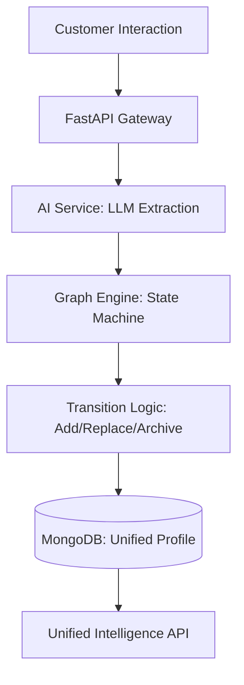

# Monarch: AI-Powered Unified Customer Intelligence

Monarch is a high-performance customer intelligence engine designed to transform multi-channel interactions into a unified, deterministic "source of truth" for customer profiles. It leverages a **Graph-Driven Memory Architecture** to separate LLM-based extraction from state-machine-driven persistence, ensuring data reliability and explainability.

## 🚀 Core Features

- **Deterministic Graph Engine**: Replaces traditional "chat history" with a structured state machine that manages entity updates, conflicts, and historical archiving.
- **Unified Customer Profile**: Consolidates interactions across channels (Chat, Audio, Web) into a single, queryable MongoDB document.
- **Incremental Summarization**: Intelligently merges new conversation context with existing summaries without duplication or data loss.
- **Multi-Turn Entity Persistence**: Tracks preferences over time, automatically archiving old values when requirements shift (e.g., changing from a Sedan to an SUV).
- **Explainable AI**: Every profile update is traceable back to specific conversation turns and confidence scores.

## 🏗️ Technical Architecture

### System Flow


### Key Components

1.  **AI Service (`app/services/ai_service.py`)**: Responsible for non-deterministic tasks like Named Entity Extraction (NER), Intent Detection, and Sentiment Analysis.
2.  **Graph Engine (`app/services/graph_engine.py`)**: The brain of the system. It receives extracted entities and applies deterministic rules to update the "Customer Context" based on confidence levels and confirmation flags.
3.  **Customer Service (`app/services/customer.py`)**: Manages the persistence layer and ensures the root `preferences` field is perfectly synchronized with the internal graph state.
4.  **Database (`app/db/mongodb.py`)**: High-performance storage using Motor (async MongoDB) for storing conversations, summaries, and complex nested profiles.

## 🛠️ Tech Stack

- **Backend**: Python 3.13, FastAPI
- **Database**: MongoDB (NoSQL)
- **Async Driver**: Motor (Tornado-based)
- **Validation**: Pydantic v2
- **Documentation**: Swagger UI, Mermaid.js

## 🏁 Getting Started

### Prerequisites
- Python 3.11+
- MongoDB 7.0+

### Installation

1. Clone the repository:
   ```bash
   git clone <repository-url>
   cd monarch/backend
   ```

2. Install dependencies:
   ```bash
   pip install -r requirements.txt
   ```

3. Set up environment variables:
   Create a `.env` file in the root:
   ```env
   MONGODB_URI=mongodb://localhost:27017
   DATABASE_NAME=monarch_db
   ```

4. Run the server:
   ```bash
   python3 -m uvicorn app.main:app --reload --port 8001
   ```

## 🔌 API Endpoints

- `POST /conversation`: Ingest multi-turn conversations.
- `GET /customer/{id}/context`: Retrieve the full unified profile, including history.
- `GET /health`: System health check.

## 🧪 Verification

Verify the system logic by running the included demo scripts:
```bash
# Verify Graph Engine transitions
python3 demo_graph_engine.py

# Verify end-to-end ingestion and persistence
bash test_api.sh
```

---
*Developed for the BeachHack Monarch project.*
